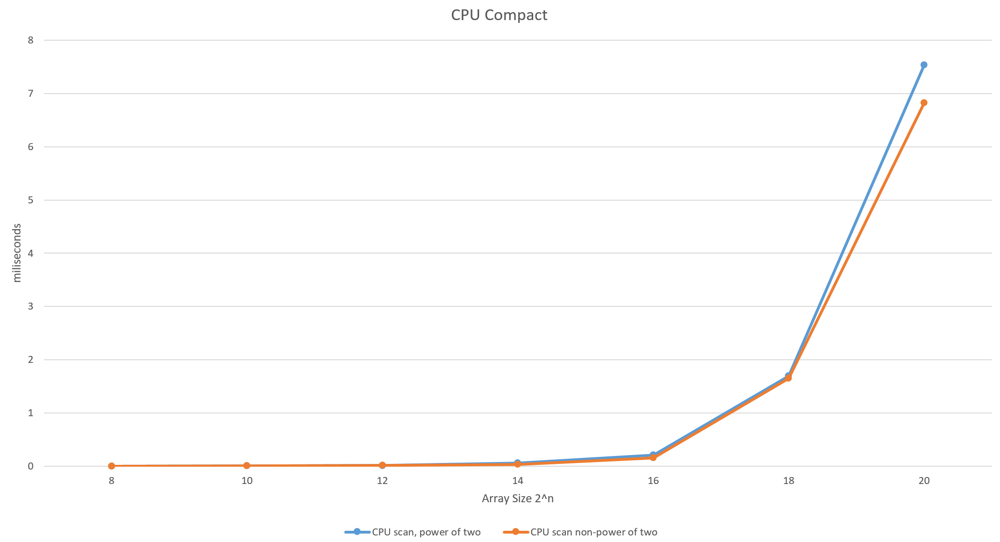

CUDA Stream Compaction
======================

**University of Pennsylvania, CIS 565: GPU Programming and Architecture, Project 2**

* Yichen Shou
  * [LinkedIn](https://www.linkedin.com/in/yichen-shou-68023455/), [personal website](http://www.yichenshou.com/)
* Tested on: Windows 10, i7-6500U @ 2.50GHz 12GB RAM, GeForce 940M 8GB (Personal Laptop)

## Project Overview

This projects implements parallel reduction and stream compaction on the GPU using CUDA. Non-parallel reduction and compaction are first implemented on the CPU sequentially to form a ground truth to compare with. Both naive and efficient versions of the parallel algorithms are then implemented on the GPU to see the degree of speed up. 

Before starting, I tested the speed of my GPU with different block sizes. Sizes of 128, 512 and 1024 performed relatively similar to each other, while 256 was a bit slower. In the end I chose the block size to be 128. Also note that the size of the arrays I tested with only go up to 2^24. After that I start to run out of memory/run into int overflow problems. 

### What is parallel reduction and stream compaction?

Parallel reduction refers to any operations that take an array of values in and spits out a single value. In this case, I'm computing the sum given an array of ints. This issue is pretty trivial on the CPU: just do a for loop and add every element. If we store the sum of every value before index 0 to i at index i, then we get an _inclusive scan_. On the other hand, storing the sum of every value from index 0 to i - 1 at index i yields an _exclusive scan_. 

Stream compaction uses exclusive scans to remove unwanted values from an array. From an initial array A of size n, a boolean array, B, of the same size is produced. B[i] will contain a 1 if the A[i] contains a valid value, and a 0 if A[i] contains an invalid value. An exlcusive scan can then be run on the boolean array B to produce array C. Finally, you can iterate through B again. This time, if B[i] is a 1, you can look at C[i] for an index value, and put A[i] at that index value in the final output array. This final scan through B that determines the indices of valid values is called a _scatter_, and it will throw out any invalid values and pack only valid values into the final array. Stream compaction is very useful in programs like path tracers. 


### How to implement this on the GPU?

The process is a bit more complicated on the GPU. Naively, you can just iterate throgh the array a bunch of times and sum up neighbors using an offset. The offset is 2^(d-1) where d is the pass you're doing. So starting at pass 1, youw would add i and i+1 together to be stored at i+1. At pass 2, you would add i and i+2 to be stored at i+2. Pass 3 would dd i and i+4 to be stored at i+4...until everything's been added and stored at the last index. The complexity of this is O(nlogn), compared to the CPU implementation's O(n).


The efficient version of the implementation is more complicated and has two steps: up-sweep and down-sweep. During up-sweep, elements in the array are added up in a balanced binary tree-like fashion, similar to what we did in the naive version but with less operations. Because we're emulating a balanced binary tree, arrays with sizes not a power of 2 must be padded out to the next power of 2. 


The down-sweep is a bit less straight forward. First, you have to set the last element to 0. Then, traversing down the binary tree, you store the node's value in its left child, and store the node's value + the original value of the left child in the right child. Rinse and repeat until every leaf's been visited. 


Finally, compact can be done in the same fashion after using this parallel method to compute the exclusive scan.

## Performance Analysis 

### CPU implementation



First up is CPU scan by itself. The algorithm operating on a power-of-two array gets slightly out performed by one on a non-power-of-two array. This makes sense because the non-power-of-two array is slightly shorter. 


I did a little experiment with the CPU compact implementation. Normally, the algorithm iterates through the entire array once for the exclusive scan, and then does another iteration for the scatter step, resulting in two full iterations of the array. I tried implementing an "optimized" version that does both scan and scatter in a single iteration. This version proved to be faster than the normal version, though still not as fast as compaction without scan, which probably has less computations to do as it doesn't concern itself with reduction at all.

### GPU implementation


The graph's a hard to read as each algorithm's power-of-two and non-power-of-two version kind of overlap, but it's clear that the optimized efficient scan algorithm runs the fastest. The non-optimized efficient scan is initially slow than the naive scan, but emerges victorious after 2^16. 

The optimization here simply involves doing some careful calcuations of indices and also tweaking the number of blocks launched to increase GPU throughput. Using the regular efficient implementation, if you launch as many threads as there are elements in the array every time, a lot of the threads will end up idle. This is because up-sweep and down-sweep are essentially binary trees, so with every level traversed, the number of threads needed will half/double. Once you take that into account and only launch threads as needed, the speed increases as every thread in every wrap is now doing meaningful computation instead of just sitting idle. 


The same speed incrased due to the optimization can also be seen with stream compaction on the GPU.

### CPU vs. GPU vs. Thrust


Comparing everything together, it's easy to see that naive scan is the slowest, followed by CPU scan and GPU scan. GPU scan appears slower than CPU scan for smaller array sizes, but triumphs over CPU after 2^18. Fastest of all is Thrust scan, which just uses NVIDIA's own Thrust library, built to perform operations like scan in CUDA. 


The compact graph shows the same idea with GPU compact underperforming for smaller arrays and slowly winning over CPU compact only as the array gets larger. Surprisingly, the GPU compact is still slower than the sequential CPU compact without scan. I think this is probably because I implemented the GPU algorithm entirely using global memory instead of shared memory. The act of reading/writing to global memory is kown to be a lot slower than just using shared memory in the individual sm. Using shared memory also forces you to divide the array into smaller chunks to be computed by each block, thus leveraging spatial locality of array accesses due to the decreased size. This reason is probably why the Thrust implementation is so fast. It might even do further optimizations based on your GPU itself based on what it detects your GPU is capable of.

## test program output for 2^20

```
****************
** SCAN TESTS **
****************
    [  24   6   1  13  17  31  49  31  38  39  27  43   2 ...  44   0 ]
==== cpu scan, power-of-two ====
   elapsed time: 2.12622ms    (std::chrono Measured)
==== cpu scan, non-power-of-two ====
   elapsed time: 2.88553ms    (std::chrono Measured)
    passed
==== naive scan, power-of-two ====
   elapsed time: 14.2575ms    (CUDA Measured)
    passed
==== naive scan, non-power-of-two ====
   elapsed time: 14.2746ms    (CUDA Measured)
    passed
==== work-efficient scan, power-of-two, optimized thread number ====
   elapsed time: 6.312ms    (CUDA Measured)
    passed
==== work-efficient scan, non-power-of-two, optimized thread number ====
   elapsed time: 6.292ms    (CUDA Measured)
    passed
==== work-efficient scan, power-of-two, unoptimized thread number ====
   elapsed time: 11.4663ms    (CUDA Measured)
    passed
==== work-efficient scan, non-power-of-two, unoptimized thread number ====
   elapsed time: 11.4702ms    (CUDA Measured)
    passed
==== thrust scan, power-of-two ====
   elapsed time: 1.33098ms    (CUDA Measured)
    passed
==== thrust scan, non-power-of-two ====
   elapsed time: 1.9503ms    (CUDA Measured)
    passed

*****************************
** STREAM COMPACTION TESTS **
*****************************
    [   1   3   1   2   2   2   0   0   1   1   3   1   3 ...   1   0 ]
==== cpu compact without scan, power-of-two ====
   elapsed time: 4.2319ms    (std::chrono Measured)
    passed
==== cpu compact without scan, non-power-of-two ====
   elapsed time: 5.80108ms    (std::chrono Measured)
    passed
==== cpu compact with scan ====
   elapsed time: 5.31476ms    (std::chrono Measured)
    passed
==== cpu compact with scan and scatter in single loop ====
   elapsed time: 8.32711ms    (std::chrono Measured)
    passed
==== work-efficient compact, power-of-two, optimized thread number ====
   elapsed time: 8.73712ms    (CUDA Measured)
    passed
==== work-efficient compact, non-power-of-two, otimized thread number ====
   elapsed time: 8.72816ms    (CUDA Measured)
    passed
==== work-efficient compact, power-of-two, , unoptimized thread number ====
   elapsed time: 13.9075ms    (CUDA Measured)
    passed
==== work-efficient compact, non-power-of-two, unoptimized thread number ====
   elapsed time: 13.9254ms    (CUDA Measured)
    passed
```